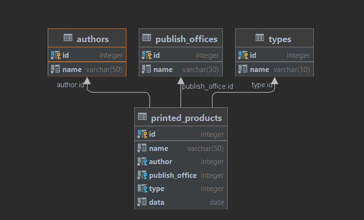

Тестовое задание "Библиотека":
-

Создаётся 4 таблицы: печатное изделие, автор, тип и издательство.
В таблице печатных изделий созданы Foreign Keys на ID каждой из оставшихся таблиц.

Поля таблицы печатных изделий:
- ID
- Название
- ID автора
- ID издательства
- ID типа
- Дата выхода изделия

У остальных таблиц: ID и название.

Удаление из таблиц не успел сделать(((

Остальное всё по требованию из задания (кроме Spring и Hibernate).